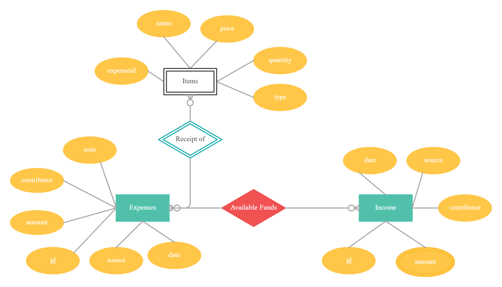

# Programming Assignment 2 
## Budget Project

### by Emelie Sevborn and Robin Svensson
### 2021-03-05

# Project Idea

For this assignment the group has chosen to create a program that could be used to track the incoming and outgoing cashflow of the user. This will be done by a CMD interface where the user can choose between various options, i.e Add Income, Expense or Items. This will be kept in a database using three tables. Income, Expenses and Items, with their respective columns. 

As the user also needs to be able to view certain aspects of their data, some queries have been made to provide easy access to smaller subsets of data i.e get all the expenses from a certain day/month, get all expenses of a certain type (food, enjoyment, fuel).

All the data used in the project is added by the user themselves, which means that the subset of data sent in will be a limited amount but should be sufficient in showing how the program functions and its capabilities.

Link to github repo: https://github.com/rynosuki/budget-project

Link to demo presentation: https://youtu.be/Py-U8kz_yIQ

# Schema Design

1. E/R Diagram of tables
  

2. RDB Chart of the tables

The design schema follows a strategy of income and expenses, where you add your income with the attributes amount, contributor, source and date. These correspond to. 

    id: auto incremented id for each row
    amount: money added to account
    contributor: person who added the money
    source: from where the money came (salary, swish etc)
    date: the days which the money got added

Expenses follows a similar schema but with an added attribute

    note: note regarding the expense (i.e Had to buy pants)

Expenses has a relation with Items using a zero to many relation to the one index of Expenses, this is working as a sort of receipt for the money you spent, Items contains the attributes.

    expenseid: this connects to the row of expenses in which the purchase was made, this to make sure there are no redundancies.
    name: productname
    price: price per unit
    quantity: amount of units
    type: product belongs to type (i.e Milk = Food)

Income and Expenses also work to figure out the remaining funds available, so while they don’t have an obvious relation visible in an RDB diagram [2], it can be seen in the corresponding E/R diagram [1]. 

# SQL Queries
## Q: Get a overlook of all expense types and corresponding price of a given month and year

Here is a multirelational query that makes use of JOIN. Two arguments are passed, x and y. The items table is joined on the expenses table by matching expenses.id with the foreign key items.expenseid when the month and year matches the passed arguments. Lastly it’s grouped by type. 

    SELECT items.type, sum(items.price*items.quantity) AS total_price
    FROM items
    JOIN expenses 
    ON expenses.id = items.expenseid 
    WHERE YEAR(expenses.date) = y AND MONTH(expenses.date) = x
    GROUP BY type;

## Q: List the most expensive item bought per month

This is a multirelational query and uses JOIN. The argument passed is marked here by x and represents the desired year. The items table is joined on the expenses table by matching the expenses.id with the foreign key items.expenseid. Further the year is compared to the given and only the item with the highest price is selected. This is then grouped by the months. 

    SELECT monthname(expenses.date) AS month, items.name, items.price*items.quantity AS price
    FROM budgetproject.items
    JOIN budgetproject.expenses
    ON expenses.id = items.expenseid
    WHERE year(expenses.date) = x AND items.price*items.quantity IN 
    (
    SELECT max(items.price*items.quantity) 
    	FROM budgetproject.items
    	GROUP BY type
    )   
    GROUP BY month(expenses.date);

## Q: Get a full receipt

This here is a multirelational query that lists the names and corresponding quantities of a given purchase. The argument passed is represented by x. The query makes use of JOIN and joins items on expenses by matching the expenses.id with the forering key items.expenseid.

    SELECT items.name, items.quantity
    FROM budgetproject.items
    JOIN budgetproject.expenses
    ON expenses.id = items.expenseid
    WHERE expenseid = x;

## Q: A year in review  

Firstly two views are created. These simply select the total income and total expenses, both with the corresponding month and year, from the income respective expenses tables. 

    View 1
      CREATE VIEW totincome AS
      SELECT 
      sum(amount) AS total, date
      FROM budgetproject.income
      GROUP BY year(date), month(date);
    View 2
      CREATE VIEW totexpenses AS
      SELECT 
      sum(amount) AS total, date
      FROM budgetproject.expenses
      GROUP BY year(date), month(date);

These are then incorporated in the next multirelational query that makes use of UNION to imitate a FULL OUTER JOIN. The things selected are the name of the months, total income and expenses and the difference between income and expenses. It joins totincome on totexpenses by matching the income.m with the expense.m for both RIGHT JOIN and LEFT JOIN. x represents the user input of the desired year.

    SELECT 
    monthname(income.date) as month,
      income.total AS income, 
      expense.total AS expenses, 
      coalesce(income.total,0) - coalesce(expense.total,0) AS profit
    FROM budgetproject.totincome AS income
    LEFT OUTER JOIN budgetproject.totexpense AS expense
    ON month(income.date) = month(expense.date)
    WHERE year(expense.date) = x AND year(income.date) = x
    UNION
    SELECT 
    monthname(expense.date) as month, 
      income.total AS income, 
      expense.total AS expenses,
      coalesce(income.total,0) - coalesce(expense.total,0) AS profit
    FROM budgetproject.totincome AS income
    RIGHT OUTER JOIN budgetproject.totexpense AS expense
    ON month(income.date) = month(expense.date)
    WHERE year(expense.date) = x AND year(income.date) = x
    ORDER BY month

##  Q: Amount spent on a certain product in the different stores.

Creates a table of the different amounts spent in different stores by joining the expenses and items on the id where the name corresponds to the name that the user wanted, this then sums up the total price of these and groups it by the store. 

    SELECT expenses.source, SUM(items.quantity*items.price), items.name
    FROM items
    JOIN expenses
    ON expenses.id = items.expenseid
    WHERE NAME = x
    GROUP BY source

# Discussion and Resources

We had a problem with the A year in review query, namely the profit as the data came out inconsistent due to there not always being a corresponding expense or income. To solve this we used UNION and both LEFT and RIGHT OUTER JOIN, thus imitating a FULL OUTER JOIN. This made sure that where either income or expense were missing the value was set to null and thus enabled the profit (or lack thereof) to be calculated correctly.

During the creation of the program we got stuck on a problem regarding how MySQL works with threads, this led to a problem called “Commands out of sync” meaning that the program tried to execute a use_result before finishing up with the previous query. This turned out to be due to how the import of our .SQL file worked, this problem was earlier taken up on a lecture in transactions which made it easier for us to design a way to fix the issue. This can be seen in the source code of the file where the implementation of importBulkData is made. 

The project itself doesn’t run on any dependencies but requires the user to have a MySQL server setup on their PC aswell as python, with which the base login for the server provided in the code is 

    {
	    Host : localhost
	    Name : root
	    Password : root
    }
